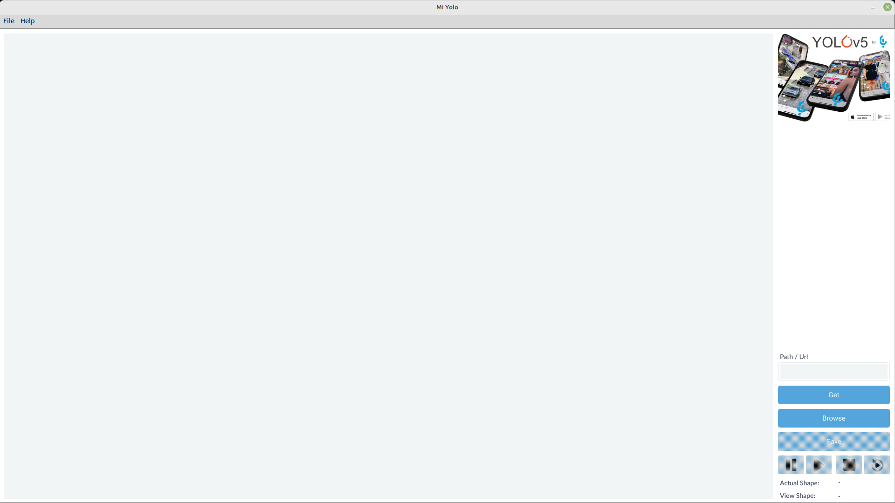
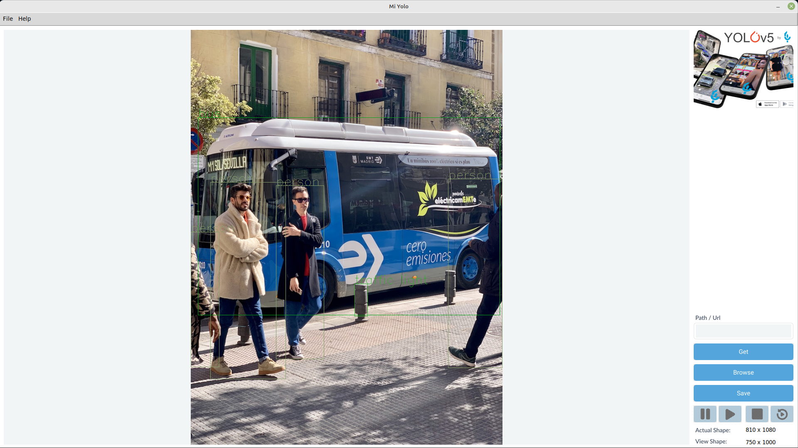

# MiYolo
___
MiYolo is a GUI for YOLOv5 object detection model using tkinter as GUI toolkit and OpenCV to handle Images and Videos.

- MiYolo can handle **Images** by entering a path or a url of an image in the **Link Entry**, browsing your files for image file by clicking the **Browse Button** or just drag and drop it into **MiYolo Canvas**.

- MiYolo can handle **Video** by entering a path of a video file or a **YouTube** url in the **Link Entry**, browsing your files for video file by clicking the **Browse Button** or just drag and drop it into **MiYolo Canvas**.

- The **image** or **video frame** will be auto resized to fit in the **canvas** but keeping the original file without any resize for saving it later.

- MiYolo will auto resize on the start to fit your primary monitor - if have multiple monitors, with fixed size for the **Toolbox** and free size for the **View Canvas**.

1 - **Path/URL** Entry - To put the path/url in it.

2 - **Get** Button - To get the media file the you enter its path/url.

3 - **Browse** Button - To browse for media file.

4 - **Save** Button - To save the output file.

5 - **Pause** Button - To pause the video.

6 - **Play** Button - To play the video after pause it.

7 - **Stop** Button - To stop the video.

8 - **Replay** Button - To replay the video.

